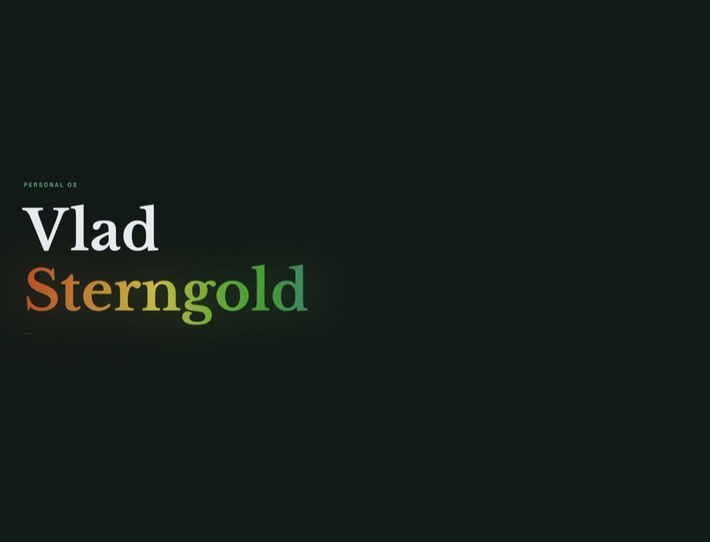
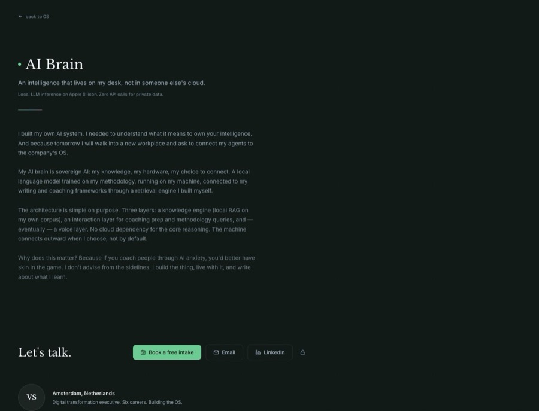
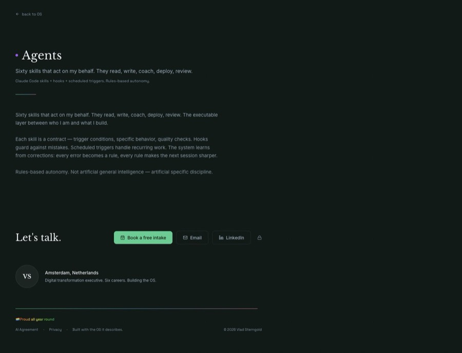

# Vlad Sterngold

### I build local-first AI systems and coach professionals through the human-AI shift.

I work at the edge where AI becomes daily practice: personal operating systems, sovereign tooling, and coaching for people who need to stay capable while the tools around them accelerate. My public GitHub shows selected artifacts; much of the real work is private by design because it runs on personal data, local machines, and client context.

---

## What I Build

| Area | Public proof | What it demonstrates |
|---|---|---|
| Personal OS / sovereign AI | [sterngold.nl](https://sterngold.nl) | A public-facing view of a private AI operating system: local-first tools, memory, agents, and identity infrastructure. |
| AI tooling | [PromptTranslator](https://github.com/sterngold/prompt-translator), [anders-repo-template](https://github.com/sterngold/anders-repo-template), [notebooklm-skill](https://github.com/sterngold/notebooklm-skill) | Reusable infrastructure for working with AI agents without losing repo discipline, source grounding, or verification habits. |
| Human-AI writing and coaching | [WerkAnders](https://werkanders.com), [The Symbiotic Mind](https://symbiotic-mind.com) | The human side of AI adoption: agency, judgment, shame, capability, and collaboration design. |

## Selected Work

| Project | What it is |
|---|---|
| **Personal OS** | A private, local-first operating system for my own life and work. The public site shows the experience; the core repo stays private because it touches personal context and local infrastructure. |
| **Anderson** | A sovereign AI engine for local RAG, methodology, and personal knowledge workflows. Private/local by design: your hardware, your data, your rules. |
| **[PromptTranslator](https://github.com/sterngold/prompt-translator)** | A product case study for an AI prompt interpreter: translates messy human intent into clearer machine-readable instructions. |
| **[anders-repo-template](https://github.com/sterngold/anders-repo-template)** | A model-agnostic repo baseline so Claude Code, Codex, Cursor, Aider, and humans all read the same conventions. |
| **[notebooklm-skill](https://github.com/sterngold/notebooklm-skill)** | A Claude Code skill that lets an agent query NotebookLM notebooks for source-grounded answers from uploaded documents. |
| **[The Symbiotic Mind](https://github.com/sterngold/the-symbiotic-mind)** | Writing on AI x HI: not "how to use AI better," but how to design the relationship between human and machine intelligence. |

## Personal OS Preview

  
  
  

## Stack And Working Style

I prefer local-first systems, explicit repo conventions, verification over vibes, and public artifacts that explain the work without exposing private context.

## Security And Disclosure

Several linked systems are public artifacts around private/local infrastructure.
Please do not open public issues for vulnerabilities or accidental disclosure.
Use the reporting path in [SECURITY.md](SECURITY.md).

## Evidence, Not Theater

AI is embedded in my daily build/write/verify loop. The signal is not "more prompts" or "more commits" as a scoreboard; it is that the tools are used deeply enough to produce inspected artifacts, reusable systems, and public writing.

Recent local operating footprint: thousands of contributions, frequent AI-assisted coding sessions, new specs, tests, screenshots, and deployment-ready public surfaces. I treat those numbers as evidence of cadence, not a claim that speed alone equals quality.

---

<i>Build with what you would be proud to depend on.</i>

